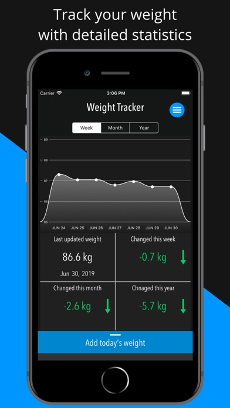
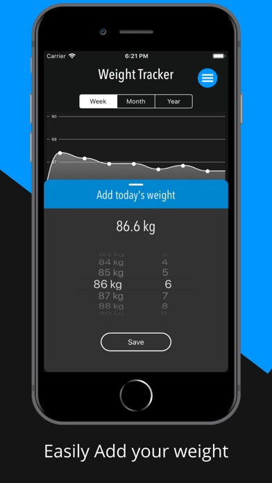
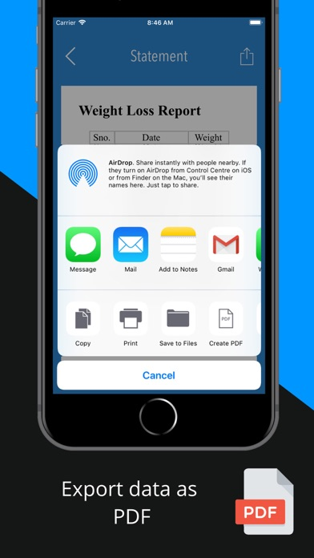
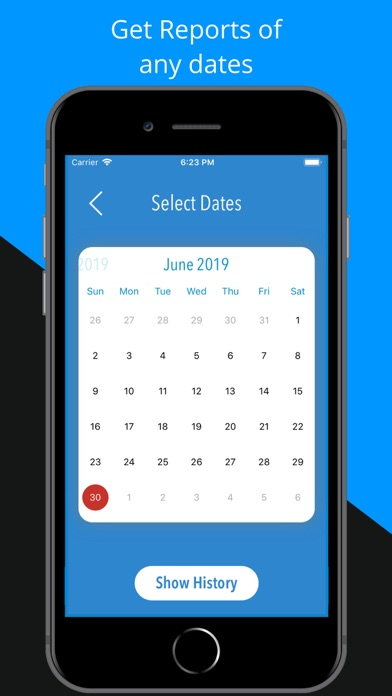
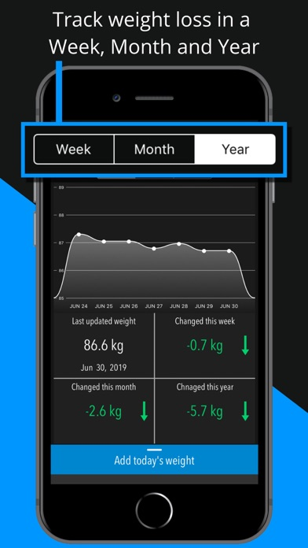
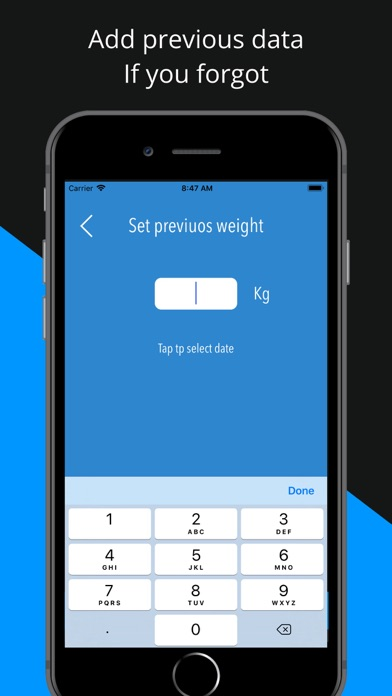

# Weight Loss Tracker App

### Weight Loss Tracker Tool provides you detailed statistics and analytics information of your body weight. You only need to add your body weight daily.

## Screenshots

### The list of the information shown on the main screen

1. Your progress on graphs
2. Weekly statistics
3.  Monthly statistics
4. Yearly statistics
5. Weight changed in a week
6. Weight changed in a month
7. Weight changed in a year
8. Provide historical data
9. Export Data as PDF
10. Add previous data if you forgot.

Simply add your weight by dragging up the card or tap on the button "Add today's weight".
As soon as new data is added, the statistics are refreshed.

User can view the information of any time period.